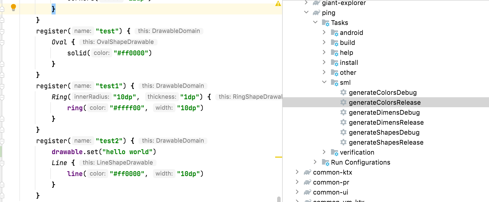
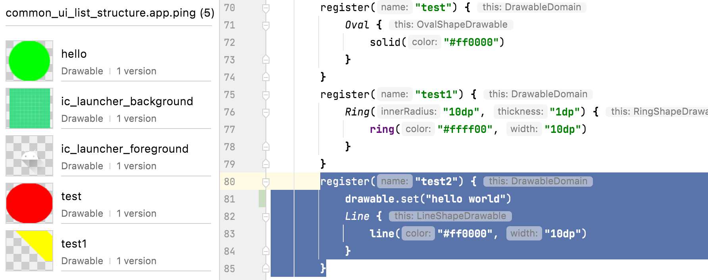
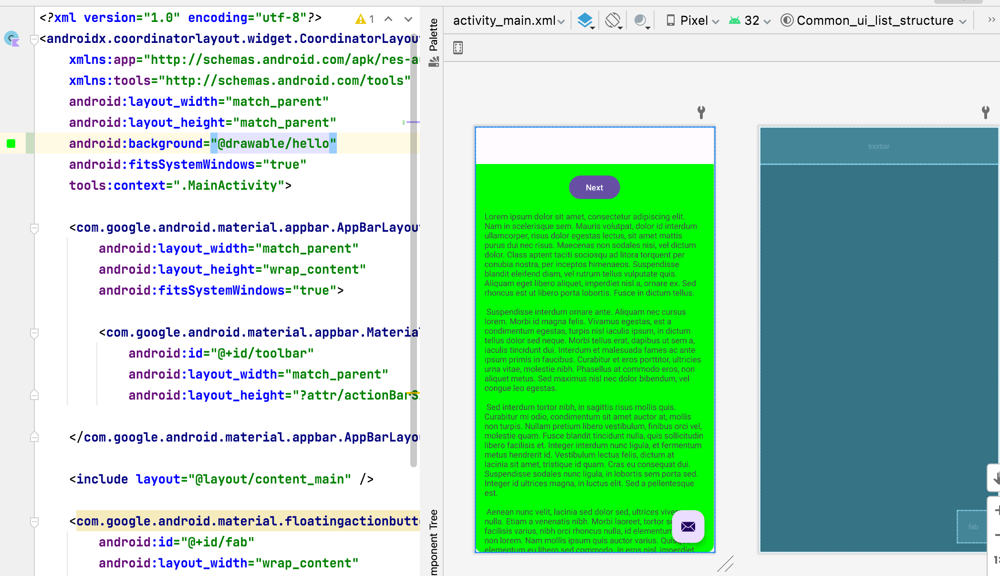
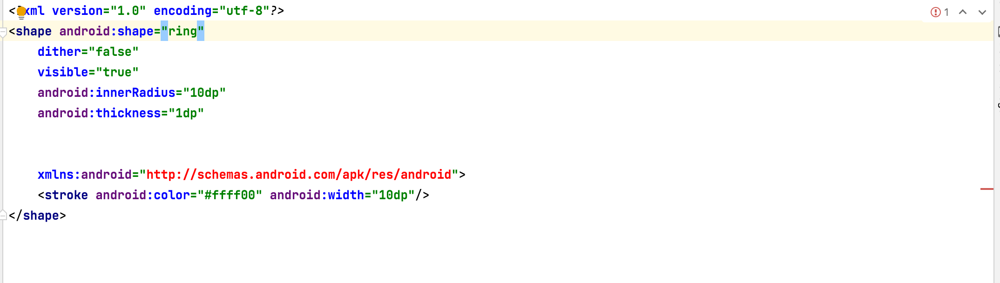

# [SML｜Gradle｜Android] 通过gradle plugin 自动生成资源文件（drawable，color，dimen。。。）

> 本人所有文章禁止任何形式的转载，谢谢

# 前言

在一个app 中，UI 通常会给出不同的设计，比如Ok 按钮和Cancel 的样式是不太一样的，每出现一个新的样式，我们就需要创建一个drawable 文件。这都还好，关键是这个drawable 文件有相当多的重复性内容，也就是说完全没有重用。像style 文件还好，不同的style 之间还可以继承。

所以如果能够给出一个自动生成这些文件的工具会更好。

从标题就能够在以后我们要怎么做的了。但是我还是说一下现阶段可以选择的工具

## 现有的解决方案

1. 通过注解生成`android.graphics.drawable.Drawable`（或者完全通过手动调用代码）。然后在代码中使用。
2. 通过继承现有的View。具体使用时还有点区别，一是通过Provider 自动替换,就像 我们明明用的是`android.widget.View`， 但是实际展示出来的却是`androidx.appcompat.widget`。二是在layout 布局中直接使用这些特殊的View。后一个的好处是可以预览到“drawable”的效果。
3. 通过data binding，在xml 中使用代码，插入`android.graphics.drawable.Drawable`。（我现阶段使用的）
4. 使用`Material`，和方案2 类似，但是有些效果可能没有。
5. 使用jetpack compose（可能是你最应该选择的）

现有的解决方案有一个问题就是无法预览到效果。虽然预览效果不是什么必须的，但我还是想要搞出来一个拥有预览能力的解决方案。

## 思考

很显然，自动生成代码吗，注解，gradle plugin，外部工具。

注解的方案还没尝试过，应该也是可以的，但是这类代码不容易写成控制、循环的代码，而且注解的参数有也严格的要求，比如不能使用可变的参数必须得是常量（在kotlin 中更为烦人，只能使用`KClass`，而不能使用`Class`）。

我还是选择的是gradle plugin。不过gradle plugin 和外部工具其实非常类似，只是说外部工具有点“脱离生态的感觉“，而且需要”一点点配置“，比如使用者可以把这个工具放到任意的什么目录。

关于通过gradle plugin 生成代码，有很多博客，可以对照着看。

[https://juejin.cn/post/6887581345384497165](https://juejin.cn/post/6887581345384497165)

[https://medium.com/@magicbluepenguin/how-to-create-your-first-custom-gradle-plugin-efc1333d4419](https://medium.com/@magicbluepenguin/how-to-create-your-first-custom-gradle-plugin-efc1333d4419)

接下来就要展示如果完成这个工具。

哎呦，还没有给这个插件起个名字呢！其实名字就在标题里`SML`，其实就是仿照`Sass` 把`xml` 改的。如果你愿意可以叫他“斯麦鲁，斯麦鲁”😊

## 开始

项目使用kotlin 以及kotlin dsl 编写，所以需要有一定的前置知识。

1. 创建一个模块。也可以不进行创建，把代码放到buildSrc中，但是我都已经给它起了个名字了🥹

    模块就是一个普通的kotlin library 即可。

    ```kotlin
    plugins {
        id 'org.jetbrains.kotlin.jvm'
        id 'java-gradle-plugin'
        id 'maven-publish'
    }
    ```
    因为代码不是在buildSrc 中，所以要应该这个插件，需要通过maven publish
    ```kotlin
    gradlePlugin {
        plugins {
            // 声明插件信息，这里的 hello 名字随意
            hello {
                version('0.0.1')
                // 插件ID
                id = 'com.storyteller_f.sml'
                // 插件的实现类
                implementationClass = 'com.storyteller_f.sml.Sml'
            }
        }
    }

    publishing {
        repositories {
            maven {
                // $rootDir 表示你项目的根目录
                url = "$rootDir/repo"
            }
        }
    }
    ```
2. 定义一个任务

    ```kotlin
    internal open class ColorTask : DefaultTask() {
        @get:OutputFile
        lateinit var outputFile: File

        @get:Input
        lateinit var colorsMap: MutableMap<String, String>
        @TaskAction
        fun makeResources() {
            colorsMap.entries.joinToString { (colorName, color) ->
                "\n    <color name=\"$colorName\">$color</color>"
            }.also { xml ->
                outputFile.writeXlmWithTags(xml)
            }
        }
    }
    ```

    `outputFile.writeXlmWithTags(xml)` 是一个扩展函数，就是把拼接好的内容存储到文件中。

    关于注解`OutputFile` 和`Input` 用来给gradle 进行增量更新判断使用。如果输入输出都没有发生变化，这个任务都会跳过。加上很有必要。

    `TaskAction` 也是必须的，很显然这个函数不是继承自`DefaultTask` 的，而且这个抽象类中也没有什么函数要继承。只有加了这个注解，gradle 才会运行这个函数。

    `@get` 是`use site target`。

    代码并不是必须要这么写，只要逻辑没问题应该就好，更多内容可以查看gradle doc的 [working_with_files_in_custom_tasks_and_plugins](https://docs.gradle.org/current/userguide/custom_plugins.html#sec:working_with_files_in_custom_tasks_and_plugins)

3. 定义一个Plugin
    ```kotlin

    class Sml : Plugin<Project> {
        override fun apply(project: Project) {
            val rootPath = "${project.buildDir}/generated"
            project.android().variants().all { variant ->
                val subPath = variant.dirName
                val colorsOutputDirectory =
                    File(File(rootPath, "sml_res_colors"), subPath).apply { mkdirs() }
                project.tasks.register(taskName(variant, "Colors"), ColorTask::class.java) {
                    it.group = "sml"
                    it.outputFile = File(colorsOutputDirectory, "values/generated_colors.xml")
                    it.colorsMap = mutableMapOf()
                    variant.registerGeneratedResFolders(project.files(colorsOutputDirectory).builtBy(it))
                }

            }

        }

        private fun taskName(variant: BaseVariant, type: String) = "generate$type${variant.name.replaceFirstChar { if (it.isLowerCase()) it.titlecase(Locale.ROOT) else it.toString() }}"
    }
    ```

    关于其中的`android` 的作用是判断当前是不是一个安卓项目，然后获取`variants`，一个没有进行过特殊处理的项目variant 只有两个`debug` 和 `release`，显然我们要为这两个都生成任务。

    `variant.registerGeneratedResFolders(project.files(colorsOutputDirectory).builtBy(it))` 也是必须的，要不然android studio不知道我们生成的文件在哪里。

    生成的文件中仅包含color，其他的资源照猫画虎就可以全部做出来。

4. 接受参数
    
    上面的例子中，参数是通过`it.colorsMap = mutableMapOf()` 指定的，因为我们的插件需要提供给不同的模块使用，现阶段不太灵活。

    ```kotlin
    interface SmlExtension {
        val color: MapProperty<String, String>
        val dimen: MapProperty<String, String>
        val drawables: NamedDomainObjectContainer<DrawableDomain>
    }
    ```

    仅仅是一个接口，因为我们根本不必实现它，gradle 会帮我们做的，只不过要求是参数需要是制定类型`Managed properties`。在上面提供的gradle doc 中也包含这部分。

    ```kotlin
    class Sml : Plugin<Project> {
        override fun apply(project: Project) {
            val extension = project.extensions.create("sml", SmlExtension::class.java)
            val rootPath = "${project.buildDir}/generated"
            // ...
        }
    }
    ```

    然后我们就可以通过`extension` 获取到参数了。其实也不是，现在获取的数据是空的，因为我们还没有传递参数。

    ```kotlin
    sml {
        color.set(mutableMapOf("test" to "#ff0000"))
    }
    ```

    这里接受的是个map 对象，不管数据源是啥，只要最终转化成一个map 即可。

    这里的sml 就是我们创建extension 是传递的那个`sml` 参数，这个函数是gradle 据此信息自动生成的。

    ```kotlin
    /**
    * Retrieves the [sml][com.storyteller_f.sml.SmlExtension] extension.
    */
    val org.gradle.api.Project.`sml`: com.storyteller_f.sml.SmlExtension get() =
        (this as org.gradle.api.plugins.ExtensionAware).extensions.getByName("sml") as com.storyteller_f.sml.SmlExtension

    /**
    * Configures the [sml][com.storyteller_f.sml.SmlExtension] extension.
    */
    fun org.gradle.api.Project.`sml`(configure: Action<com.storyteller_f.sml.SmlExtension>): Unit =
        (this as org.gradle.api.plugins.ExtensionAware).extensions.configure("sml", configure)

    ```

5. 支持更多类型

    上面演示的只有color 和dimen，关于drawable 还没有说。drawable 更为复杂，不能像color 那样用一个`MapProperty<String, String>` 就给打发了。在这里我们使用`NamedDomainObjectContainer`，这个对象是一个`Collection`，可以放入很多数据。

    ```
    interface DrawableDomain {
        // Type must have a read-only 'name' property
        val name: String?

        val drawable: Property<String>
    }
    ```

    不过有一个要求是，范型内要求包含一个不可变的字段`name`。其实还有一个，其他的字段要求是可序列化的🥹。就在写博客前，用的还是自定义的对象，但是太过麻烦，几乎所有相关的类都需要可序列化，所以最好办法的还是接受一个String。而且这样还有一个好处，等会说。

6. kotlin dsl

    我希望配置参数时的代码更清晰，所以最好能是这种写法。

    ```kotlin
    sml {
        color.set(mutableMapOf("test" to "#ff0000"))
        dimen.set(mutableMapOf("test1" to "12"))
        drawables {
            register("hello") {
                Rectangle {
                    solid("#00ff00")
                    corners("12dp")
                }
            }
            register("test") {
                Oval {
                    solid("#ff0000")
                }
            }
            register("test1") {
                Ring("10dp", "1dp") {
                    ring("#ffff00", "10dp")
                }
            }
            register("test2") {
                Line {
                    line("#ff0000", "10dp")
                }
            }
        }
    }
    ```

    所以需要类似这样的扩展函数（真的是体力活）。

    ```kotlin
    fun DrawableDomain.Oval(block: OvalShapeDrawable.() -> Unit) {
        drawable.set(OvalShapeDrawable().apply {
            start()
        }.apply(block).output())
    }

    fun DrawableDomain.Ring(innerRadius: String, thickness: String, block: RingShapeDrawable.() -> Unit) {
        drawable.set(RingShapeDrawable(innerRadius, thickness, false).apply { start() }.apply(block).output())
    }

    fun DrawableDomain.Ring(innerRadiusRatio: Float, thicknessRatio: Float, block: RingShapeDrawable.() -> Unit) {
        drawable.set(RingShapeDrawable(innerRadiusRatio.toString(), thicknessRatio.toString(), true).apply { start() }.apply(block).output())
    }

    fun DrawableDomain.Line(block: LineShapeDrawable.() -> Unit) {
        drawable.set(LineShapeDrawable().apply { start() }.apply(block).output())
    }
    ```

    具体相关的类，可以去我的github 看[https://github.com/storytellerF/common-ui-list-structure](https://github.com/storytellerF/common-ui-list-structure)。

    上面这种写法你也许不喜欢，不过没关系，因为drawable 最终接受的是一个字符串，所以你也可以写成这样（这就是我上面说的好处）。

    ```kotlin
    register("test2") {
        drawable.set("hello world")
        //Line {
        //    line("#ff0000", "10dp")
        //}
    }
    ```

7. 生成

    现在我们开始生成这些玩具吧，代码写好后，我们需要进行gradle sync，同步之后，在相应模块的任务列表下就能找到我们的任务了。

    

    执行任务试试吧。

8. 成果

    

    在resource manager 中预览正常😊

     layout 中预览正常😊

## 后言

当前也是有个小问题的，在生成的资源文件中android studio 不提供预览功能。



可能Google 的开发人员认为这个是自动生成的，所以你应该对于生成出来的内容拥有绝对的认知吧。

最优先的的选择应该还是jetpack compose，但是如果因为某些原因而不能，那么“SML” 应该是最好的选择了吧😊


